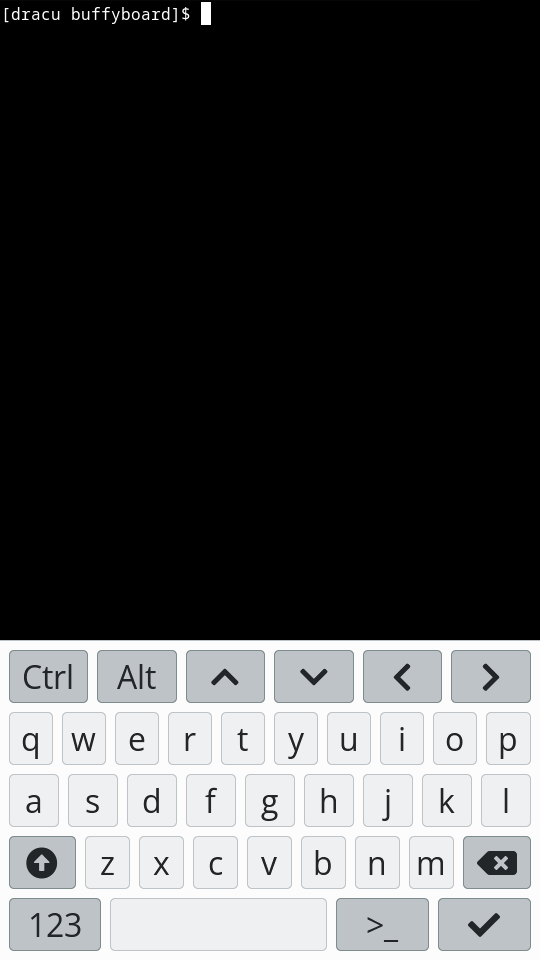
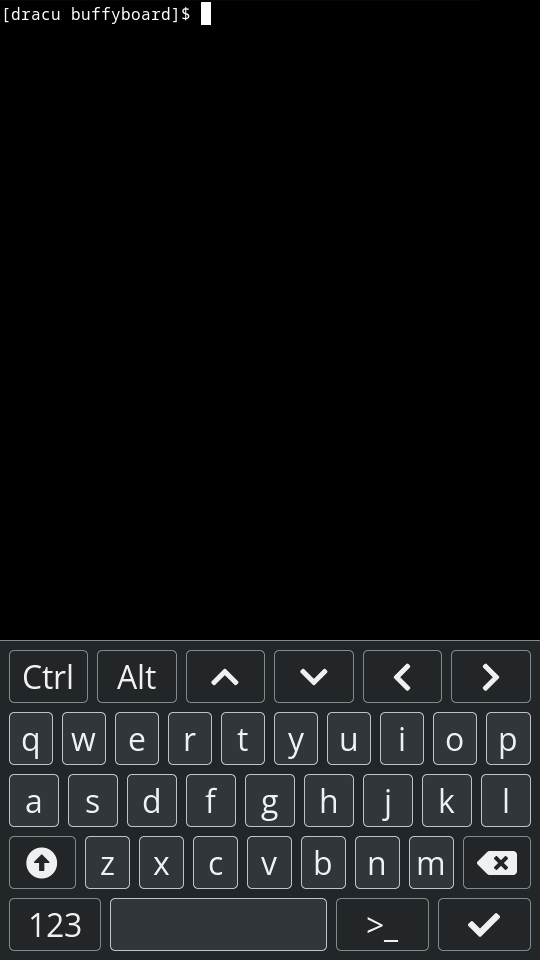
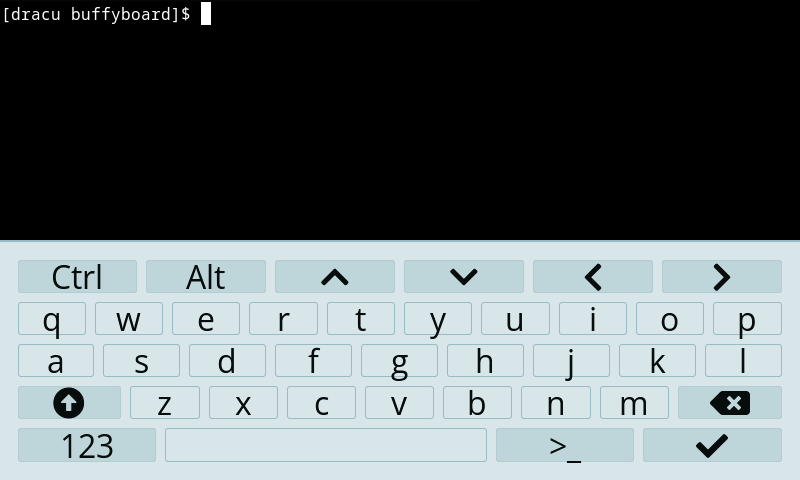
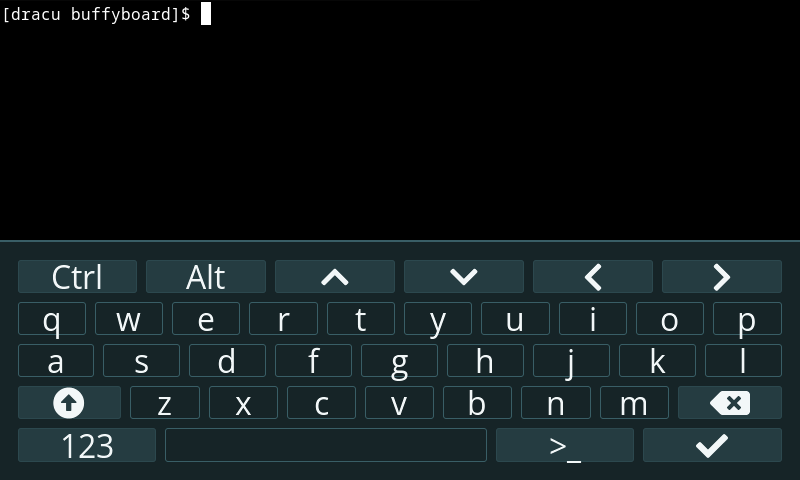

Buffyboard
==========

Touch-enabled framebuffer keyboard (not only) for vampire slayers.

[[_TOC_]]

# About

Buffyboard is a touch-enabled on-screen keyboard running on the Linux framebuffer. It's primarily intended for vampire hunting[^1] but you can also use it as a general purpose keyboard.

Buffyboard uses [LVGL] for input processing and rendering. Key events are forwarded directly to the kernel via a uinput device. Since the latter emulates a hardware keyboard, the terminal keymap must match with buffyboard's layout or else on-screen keys might not produce the correct result.

# Status

We are en route to v1 which aims at providing a useable, visually pleasant application including [fbkeyboard]'s most essential features. For details about the current status, see the [v1 milestone]. You may also browse the full list of [open issues] to get an idea of what's planned beyond v1.

Here are a few highlights of what already works:

- On-screen keyboard control via mouse, trackpad or touchscreen
- Multi-layer keyboard layout including lowercase letters, uppercase letters, numbers and selected symbols (based on top three layers of [squeekboard's US terminal layout])
- Key chords with one or more modifiers terminated by a single non-modifier (e.g. `CTRL-c`)
- Highlighting of active modifiers
- Automatic resizing (and later reset) of active VT to prevent overlap with keyboard
- Theming support

Screenshots of the currently available themes may be found in the [screenshots] folder.



<br>



# Usage

You can get an overview of available command line options by running it with the `-h` or `--help` argument.

```
$ buffyboard --help
Usage: buffyboard [OPTION]

Mandatory arguments to long options are mandatory for short options too.
  -C, --config-override     Path to a config override file. Can be supplied
                            multiple times. Config files are merged in the
                            following order:
                            * /usr/share/buffyboard/buffyboard.conf
                            * /usr/share/buffyboard/buffyboard.conf.d/* (alphabetically)
                            * /etc/buffyboard.conf
                            * /etc/buffyboard.conf.d/* (alphabetically)
                            * Override files (in supplied order)
  -g, --geometry=NxM[@X,Y]  Force a display size of N horizontal times M
                            vertical pixels, offset horizontally by X
                            pixels and vertically by Y pixels
  -d  --dpi=N               Override the display's DPI value
  -r, --rotate=[0-3]        Rotate the UI to the given orientation. The
                            values match the ones provided by the kernel in
                            /sys/class/graphics/fbcon/rotate.
                            * 0 - normal orientation (0 degree)
                            * 1 - clockwise orientation (90 degrees)
                            * 2 - upside down orientation (180 degrees)
                            * 3 - counterclockwise orientation (270 degrees)
  -h, --help                Print this message and exit
  -v, --verbose             Enable more detailed logging output on STDERR
  -V, --version             Print the buffyboard version and exit
```

For an example configuration file, see [buffyboard.conf].

# Development

## Dependencies

- [inih]
- [lvgl] (git submodule / linked statically)
- [squeek2lvgl] (git submodule / linked statically)
- [libinput]
- [libudev]
- evdev kernel module
- uinput kernel module

## Keyboard layouts

Buffyboard uses [squeekboard layouts] converted to C via [squeek2lvgl]. To regenerate the layouts, ensure that you have pipenv installed (e.g. via `pip install --user pipenv`) and then run

```
$ ./regenerate-layouts.sh
```

## Generating screenshots

To generate screenshots in a variety of common sizes, install [fbcat], build buffyboard and then run

```
$ sudo ./regenerate-screenshots ../_build/unl0kr/buffyboard
```

where `../_build/unl0kr/buffyboard` is the location of the buffyboard binary.

# Acknowledgements

The [lv_port_linux_frame_buffer] project served as a starting point for the codebase.

The mouse cursor image was taken from [lv_sim_emscripten].

Buffyboard was inspired by [fbkeyboard].

# Footnotes

[^1]: If you still don't know what vampires have to do with all of this, the train of thought is: Linux frame**buffer** 👉 **buffy**board 👉 ... wait for it ... 👉 [**Buffy** the Vampire Slayer]. There you have it. I never claimed I was funny. 😅

[**Buffy** the Vampire Slayer]: https://en.wikipedia.org/wiki/Buffy_the_Vampire_Slayer
[LVGL]: https://lvgl.io
[arrow-alt-circle-up]: https://fontawesome.com/v5.15/icons/arrow-alt-circle-up?style=solid
[buffyboard.conf]: ./buffyboard.conf
[fbcat]: https://github.com/jwilk/fbcat
[fbkeyboard]: https://github.com/bakonyiferenc/fbkeyboard
[inih]: https://github.com/benhoyt/inih
[libinput]: https://gitlab.freedesktop.org/libinput/libinput
[libudev]: https://github.com/systemd/systemd/tree/main/src/libudev
[lv_port_linux_frame_buffer]: https://github.com/lvgl/lv_port_linux_frame_buffer
[lv_sim_emscripten]: https://github.com/lvgl/lv_sim_emscripten/blob/master/mouse_cursor_icon.c
[lvgl]: https://github.com/lvgl/lvgl
[open issues]: https://gitlab.com/cherrypicker/buffyboard/-/issues
[screenshots]: ./screenshots
[squeek2lvgl]: https://gitlab.com/cherrypicker/squeek2lvgl]
[squeekboard layouts]: https://gitlab.gnome.org/World/Phosh/squeekboard/-/blob/master/data/keyboards
[squeekboard's US terminal layout]: https://gitlab.gnome.org/World/Phosh/squeekboard/-/blob/master/data/keyboards/terminal/us.yaml
[squeekboard]: https://gitlab.gnome.org/World/Phosh/squeekboard/-/tree/master
[v1 milestone]: https://gitlab.com/cherrypicker/buffyboard/-/milestones/1
